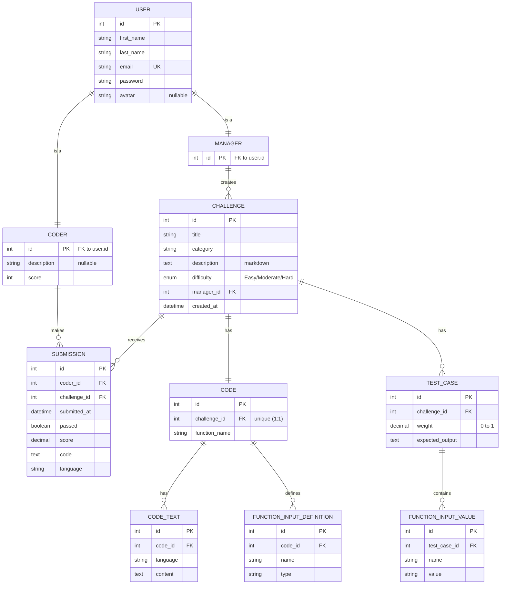

# CodeCLA — Database Design

This document is the deliverable for the **Database Design** assignment. It has
two parts:

1. **Task 1 — Entities & Relationships:** the entities extracted from the brief,
   their attributes, and the relationships between them.
2. **Task 2 — The ER diagram:** a Mermaid entity-relationship diagram (renders
   inline on GitHub). A polished SVG version lives at
   [`database-erd.svg`](./database-erd.svg), and there's an interactive
   crow's-foot rendering as a
   [visual page](https://claude.ai/code/artifact/95acfd06-77ab-4f0d-986b-223799fe21e4).

The schema backs the same domain the [`coders-app-api`](../coders-app-api) serves
today with stubbed data; this design is what a later assignment will wire those
services to.

---

## Task 1 — Entities, attributes & relationships

### Users: a supertype with two subtypes

Coders and Managers share the same account information (name, email, password,
avatar), so the shared fields are modelled once on a **User** supertype, with
**Coder** and **Manager** as subtypes (a one-to-one "is-a" specialisation). Only
Coders carry the extra `description` and `score` (the latter drives the
leaderboard).

**User** — shared account info
| Attribute | Type | Key / Notes |
| --- | --- | --- |
| id | int | **PK** |
| first_name | varchar | |
| last_name | varchar | |
| email | varchar | **UK** (unique per user) |
| password | varchar | |
| avatar | varchar | nullable (optional) |

**Coder** *(is-a User)*
| Attribute | Type | Key / Notes |
| --- | --- | --- |
| id | int | **PK**, **FK** → User.id |
| description | text | nullable — the coder's passion/interests |
| score | int | leaderboard score |

**Manager** *(is-a User)* — no extra attributes
| Attribute | Type | Key / Notes |
| --- | --- | --- |
| id | int | **PK**, **FK** → User.id |

### Content: Challenge, Code and its parts

**Challenge** — a coding challenge, owned by the Manager who authored it
| Attribute | Type | Key / Notes |
| --- | --- | --- |
| id | int | **PK** |
| title | varchar | |
| category | varchar | e.g. "Data structure", "Graphs" |
| description | text | markdown (for UI rendering) |
| difficulty | enum | `Easy` \| `Moderate` \| `Hard` |
| manager_id | int | **FK** → Manager.id |
| created_at | datetime | |

**Code** — the starter code for a challenge (one per challenge)
| Attribute | Type | Key / Notes |
| --- | --- | --- |
| id | int | **PK** |
| challenge_id | int | **FK** → Challenge.id, **UK** (1:1) |
| function_name | varchar | the function coders must implement |

**CodeText** — the starter code content, one row per language
| Attribute | Type | Key / Notes |
| --- | --- | --- |
| id | int | **PK** |
| code_id | int | **FK** → Code.id |
| language | varchar | e.g. `py`, `js` |
| content | text | the code for that language |

**FunctionInputDefinition** — describes one argument of the function
| Attribute | Type | Key / Notes |
| --- | --- | --- |
| id | int | **PK** |
| code_id | int | **FK** → Code.id |
| name | varchar | argument name |
| type | varchar | argument type |

### Tests: TestCase and its input values

**TestCase** — one graded case for a challenge
| Attribute | Type | Key / Notes |
| --- | --- | --- |
| id | int | **PK** |
| challenge_id | int | **FK** → Challenge.id |
| weight | decimal | between 0 and 1 (relative importance) |
| expected_output | text | the expected result |

**FunctionInputValue** — one named input value for a test case
| Attribute | Type | Key / Notes |
| --- | --- | --- |
| id | int | **PK** |
| test_case_id | int | **FK** → TestCase.id |
| name | varchar | matches a FunctionInputDefinition name |
| value | text | the value for this test |

### Grading: Submission

**Submission** — a coder's graded attempt at a challenge
| Attribute | Type | Key / Notes |
| --- | --- | --- |
| id | int | **PK** |
| coder_id | int | **FK** → Coder.id |
| challenge_id | int | **FK** → Challenge.id |
| submitted_at | datetime | submission time |
| passed | boolean | whether it passed grading |
| score | decimal | final score after grading |
| code | text | the submitted code |
| language | varchar | `py` \| `js` (needed by the grader) |

### Relationships (with cardinality)

| Relationship | Cardinality | Notes |
| --- | --- | --- |
| User – Coder | 1 : 1 | "is-a" specialisation |
| User – Manager | 1 : 1 | "is-a" specialisation |
| Manager **creates** Challenge | 1 : N | a manager owns many challenges; each challenge has one manager |
| Challenge **has** Code | 1 : 1 | each challenge has exactly one starter Code |
| Code **has** CodeText | 1 : N | one row per language |
| Code **defines** FunctionInputDefinition | 1 : N | the function's argument list |
| Challenge **has** TestCase | 1 : N | a challenge's graded tests |
| TestCase **contains** FunctionInputValue | 1 : N | the inputs for that test |
| Coder **makes** Submission | 1 : N | a coder's attempts |
| Challenge **receives** Submission | 1 : N | attempts against a challenge |

**Design notes**

- `Submission` sits between `Coder` and `Challenge` (a coder submits to a
  challenge), but it's a full entity with its own attributes and identity, not a
  plain join table.
- `FunctionInputValue.name` mirrors a `FunctionInputDefinition.name` — the value
  supplied for a test lines up with the defined argument by name.
- The `User` supertype avoids duplicating the account columns across Coder and
  Manager; the subtype PKs double as FKs back to `User`.

---

## Task 2 — ER diagram

> A polished, crow's-foot rendering of the same diagram is committed as
> [`database-erd.svg`](./database-erd.svg).
